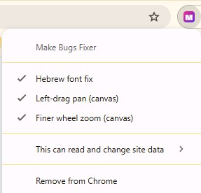

# תוסף Make Bugs Fixer - תיקוני קהילה ל-Make.com

מדובר בתוסף Chrome קטן וקוד-פתוח. התיקון המרכזי שלו היום הוא רינדור הפונט העברי המכוער ב-Make וב-Boost.space, מטרד ש-Make עדיין לא פתרו. בנוסף הוא כולל שני תיקונים אופציונליים שבזמנם פתרו מטרדי קאנבס - זום עדין בגלגלת וגרירה שמאלית - אבל מאז Make תיקנו את שניהם נייטיב, ולכן שניהם כבויים כברירת מחדל ונשארים זמינים להדלקה ידנית למי שעדיין צריך אותם. כל תיקון נדלק או נכבה בנפרד, בקליק ימני על אייקון התוסף.

<blockquote dir="rtl">
תוסף קהילתי לא רשמי. אינו מזוהה עם Make או מסונף אליו בשום צורה. השם "Make" מופיע לתיאור בלבד.
</blockquote>

## מה הוא מתקן

<ul dir="rtl">
<li><b>פונט עברי</b> - הפונט של Make ו-Boost.space (Inter) לא כולל גליפים עבריים, אז כל מילה עברית נופלת לפונט serif של ברירת המחדל ונראית שבורה ליד הלטינית הנקייה. התוסף מוסיף את Segoe UI כ-fallback <b>רק לגליפים העבריים</b>: הלטינית והספרות נשארות בפונט המקורי של האתר, והעברית מקבלת פונט sans נקי. רץ על <code>make.com</code> וגם על <code>boost.space</code>.</li>
<li><b>זום עדין בגלגלת (Make בלבד) - אופציונלי, כבוי כברירת מחדל</b> - בעבר כל נקישת גלגלת בקאנבס קפצה רחוק מדי, והתוסף הקטין את צעד הזום (כשליש). מאז Make החזירו את רגישות הזום הנייטיב להתנהגות שלפני שדרוג הקאנבס, אז הקטנת הצעד שלנו רק הופכת אותו לאיטי מדי. לכן התיקון <b>כבוי כברירת מחדל</b> ונשאר זמין למי שעדיין מעדיף צעדים עדינים יותר.</li>
<li><b>גרירה בכפתור שמאלי (Make בלבד) - אופציונלי, כבוי כברירת מחדל</b> - בעורך הסצנות החדש Make העבירו את הזזת הקאנבס (pan) לכפתור הימני, והתוסף ניסה לפתור זאת ולהחזיר את הגרירה השמאלית. בינתיים נראה ש-Make החליטו לאפשר למשתמש לבחור בעצמו: יש עכשיו <b>הגדרה רשמית</b> שבוחרת איזה כפתור גורר את הקאנבס (View ← Preferences ← Input device settings ← Canvas panning; הכפתור השני עושה multi-select). לכן התיקון הזה <b>כבוי כברירת מחדל</b> ומיועד רק למי שאין לו עדיין את ההגדרה הנייטיב. <b>אל תדליקו אותו יחד עם ההגדרה הנייטיב</b> - הם מתנגשים (גרירה שמאלית תפתח אז גם pan וגם בחירה מרובה). ראו את <a href="https://community.make.com/t/feature-spotlight-canvas-navigation-now-moves-with-you/109589">הת'רד הרשמי של Make</a>.</li>
</ul>

## התקנה

<blockquote dir="rtl">
<b>הורדה מהירה:</b> קובץ ZIP מוכן יושב ב-<a href="https://github.com/arielmoatti/make-bugs-fixer/releases/latest">Releases</a> (מופיע גם בצד ימין של עמוד הריפו). הורידו אותו, חלצו, והמשיכו משלב 2.
</blockquote>

<ol dir="rtl">
<li>הורידו את הקוד: לחצו על הכפתור הירוק <code>Code &lt;&gt;</code> ואז <b>Download ZIP</b>, וחלצו לתיקייה. (אפשר גם להוריד מה-<b>Release</b>.)</li>
<li>פתחו בכרום את <code>chrome://extensions</code>.</li>
<li>הדליקו <b>Developer mode</b> (פינה ימנית עליונה).</li>
<li>לחצו <b>Load unpacked</b> ובחרו את התיקייה שחילצתם (זו שמכילה את <code>manifest.json</code>).</li>
<li>פתחו או רעננו טאב של Make. זהו.</li>
</ol>

## הדלקה וכיבוי (Toggle)

קליק ימני על אייקון התוסף ← שני סימוני וי:

<ul dir="rtl">
<li><b>Hebrew font fix</b> - תיקון הפונט העברי.</li>
<li><b>Finer wheel zoom (canvas)</b> - זום עדין בגלגלת (כבוי כברירת מחדל; Make תיקנו את הזום הנייטיב).</li>
<li><b>Left-drag pan (canvas)</b> - גרירה שמאלית לקאנבס (כבוי כברירת מחדל; ראו ההסבר למעלה).</li>
</ul>

הגרירה השמאלית והזום העדין מתחלפים מיידית. תיקון הפונט חל במלואו אחרי רענון הדף.

## איך הגרירה עובדת (לסקרנים)

(תזכורת: תיקון הגרירה כבוי כברירת מחדל מאז שהגיעה ההגדרה הנייטיב של Make. ההסבר הבא רלוונטי רק אם בחרתם להדליק אותו.) העורך החדש מצייר את כל הסצנה על אלמנט <code>canvas</code> יחיד, וה-pan מופעל על ידי pointer events עם כפתור ימני. כשמתחילים גרירה שמאלית על רקע ריק, התוסף זורק אירוע <code>pointerdown</code> ימני סינתטי שמשתמש ב-pointerId האמיתי של העכבר. כך מנגנון ה-pan המקורי של Make רץ על התנועות האמיתיות שלך. גרירה על מודול לא מושפעת.

(תזכורת: גם תיקון הזום כבוי כברירת מחדל מאז ש-Make החזירו את רגישות הזום הנייטיב. ההסבר הבא רלוונטי רק אם בחרתם להדליק אותו.) הזום בקאנבס מתואם לעוצמת ה-<code>deltaY</code> של הגלגלת. כשווינדוס מוגדרת לגלול כמה שורות בכל נקישה (ברירת המחדל היא 3), כל נקישה קפצה רחוק מדי. התוסף תופס את אירוע הגלגלת מעל הקאנבס, מבטל אותו, ומשגר אירוע סינתטי עם <code>delta</code> מוקטן (כשליש), כך שכל נקישה מזיזה צעד זום קטן ועדין. כדי לכוונן את העדינות אפשר לשנות את <code>FACTOR</code> בקובץ <code>zoom-fix.js</code> (ערך נמוך יותר ← זום עדין יותר).

## סייגים

<ul dir="rtl">
<li>זיהוי "רקע ריק מול מודול" מבוסס דגימת פיקסלים. גרירה שמתחילה בדיוק על קו צבעוני באוויר עלולה לא להיתפס כריקה.</li>
<li>אם Make ישנו שוב את מבנה הקאנבס, ייתכן שהתוסף יצטרך עדכון.</li>
</ul>

## רישיון

&rlm;MIT - ראו <a href="LICENSE">LICENSE</a>.

English summary

**Make Bugs Fixer** is a small, unofficial, open-source Chrome extension for a few Make.com annoyances. Each fix toggles independently via **right-click on the extension icon**. Not affiliated with Make.

**Finer mouse-wheel zoom (Make only) - optional, OFF by default.** Make scales canvas zoom to the wheel's `deltaY`. On Windows, where the wheel scrolls several lines per notch by default (usually 3), every notch used to jump too far. The extension intercepts the wheel over the canvas, cancels it, and re-dispatches a synthetic event with the delta scaled down (~1/3), so each notch is a small, controlled zoom step. Make has since restored the native wheel-zoom sensitivity to its pre-canvas-update behaviour, so scaling the delta down now over-damps it (zooming feels sluggish). The fix therefore ships **off**; enable it from the icon menu if you still prefer finer steps, and tune `FACTOR` in `zoom-fix.js` (lower = finer).

**Left-click drag pan (Make only) - optional, OFF by default.** When Make's new editor moved canvas panning from left-drag to right-drag, this extension restored left-drag panning: on a left-drag over empty canvas it dispatches a synthetic right-button `pointerdown` that reuses the **real** pointerId, so Make's native pan runs on your real mouse moves (dragging modules stays unaffected). Make has since added an **official setting** to choose which button pans the canvas (*View → Preferences → Input device settings → Canvas panning*; the other button multi-selects modules). So this fix is no longer needed for most users and now ships **off**. Enable it from the icon menu only if you don't have the native setting yet, and **don't run both at once** - they conflict (a left-drag would trigger pan *and* multi-select). See Make's [official thread](https://community.make.com/t/feature-spotlight-canvas-navigation-now-moves-with-you/109589).

**Hebrew font (Make + Boost.space).** Their UI font (Inter) ships Latin-only, so Hebrew has no glyphs and falls back to the platform serif (Times New Roman on Windows), looking broken next to the Latin sans. The extension appends Segoe UI as a fallback to each element's existing stack, so only the Hebrew glyphs switch fonts while Latin and digits stay in the site's font. Runs on `make.com` and `boost.space`.

**Install:** download/clone → `chrome://extensions` → enable Developer mode → **Load unpacked** → pick the folder.

